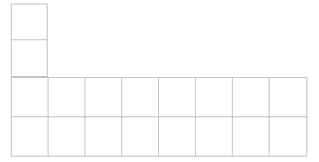

# 青蛙跳台阶问题

```
一只青蛙一次可以跳上1级台阶, 也可以跳上2级台阶. 求改青蛙跳上一个n级的台阶总共有多少种跳法.
```

## 思路1 递归法

假设阶数n=1, 只有1种跳法

假设阶数n=2, 有2种跳法, 第一次跳1阶, 第二次跳1阶; 或一次跳2阶

假设阶数n>=3, 分两种情况:

​	第一次跳1阶:

​	第一次跳2阶:

这显然可以看做递归问题:

f(1) = 1

f(2) = 2

...

f(n) = f(n-1) + f(n-2), n>=3


```java
public int numberSteps(int n){
    if(n<=0) return 0;
    if(n==1 || n==2)
    	return n;
    return numberSteps(n-1) + numberSteps(n-2);
}
```


## 思路2 循环法

```java
public int numberSteps(int n){
    if(n<=0) return 0;
    if(n==1 || n==2)
    	return n;
    int n1 = 2, n2=1;
    for(int i=3; i<=n; i++){
        int cur = n1 + n2;
        n2 = n1;
        n1 = cur;
    }
    return n1;
}
```


## 青蛙跳台阶扩展

假设青蛙一次可以跳1阶, 2阶..., n阶, 此时青蛙跳上一个n阶的台阶总共有多少种跳法?

可以用归纳法证明:

f(1) = 1;

f(2) = f(1) + 1=2;

f(3) = f(2) + f(1) + 1=4;

f(4) = f(3) + f(2) + f(1) + 1 = 8;

...

f(n) = $1+\sum_{i=1}^{n}f(i)$ = $2^{n-1}$


## 相关题目

我们可以用2x1的小矩形横着或者竖着去覆盖更大的矩形.请问用8个2x1的小矩形无重叠地覆盖一个2x8的大矩形,总共有多少种方法?




如果第一次竖着放置, 剩下7x2个矩形;

如果第一次在左上角横着放置, 那么相当于剩下6x2个矩形; 因为该横着放置的小矩形下面,只能横着放置一个小矩形;

当剩下1x2个矩形时, 只能有1种放法;

当剩下2x2个矩形时, 有2中放法;

f(1) = 1

f(2) = 2

...

f(8) = f(7) + f(6)

这还是Fibonacci数列问题:

## 解法1: 递归法

```java
public int getMethods(int n){
    if(n<=0)
    	return 0;
    if(n==1 || n==2)
    	return n;
    return getMethods(n-1) + getMethods(n-2);
}
```


## 解法2: 循环法

```java
public int getMethods(int n){
    if(n<=0)
    	return 0;
    if(n==1 || n==2)
    	return n;
    int n1 = 2;
	int n2 = 1;
	for(int i=3; i<=n; i++){
        int cur=n1+n2;
        n2 = n1;
        n1 = cur;
	}
	return n1;
}
```

