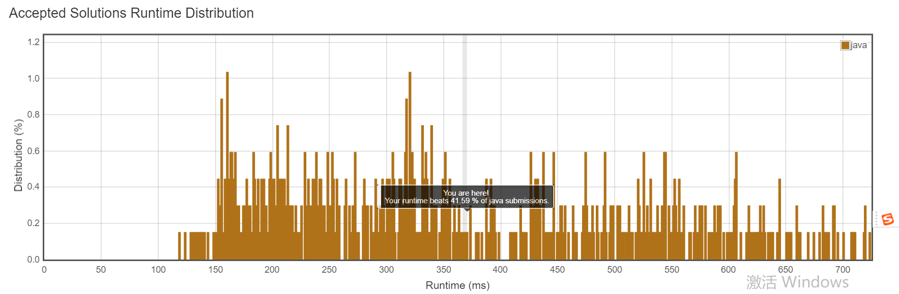

Implement a `MyCalendarTwo` class to store your events. A new event can be added if adding the event will not cause a **triple** booking.

Your class will have one method, `book(int start, int end)`. Formally, this represents a booking on the half open interval `[start, end)`, the range of real numbers `x` such that `start <= x < end`.

A *triple booking* happens when **three** events have some non-empty intersection (ie., there is some time that is common to all 3 events.)

For each call to the method `MyCalendar.book`, return `true` if the event can be added to the calendar successfully without causing a **triple** booking. Otherwise, return `false` and do not add the event to the calendar.

Your class will be called like this: 

```
MyCalendar cal = new MyCalendar();
```

 

```
MyCalendar.book(start, end)
```

**Example 1:**

```
MyCalendar();
MyCalendar.book(10, 20); // returns true
MyCalendar.book(50, 60); // returns true
MyCalendar.book(10, 40); // returns true
MyCalendar.book(5, 15); // returns false
MyCalendar.book(5, 10); // returns true
MyCalendar.book(25, 55); // returns true
Explanation: 
The first two events can be booked.  The third event can be double booked.
The fourth event (5, 15) can't be booked, because it would result in a triple booking.
The fifth event (5, 10) can be booked, as it does not use time 10 which is already double booked.
The sixth event (25, 55) can be booked, as the time in [25, 40) will be double booked with the third event;
the time [40, 50) will be single booked, and the time [50, 55) will be double booked with the second event.
```

**Note:**

The number of calls to `MyCalendar.book` per test case will be at most `1000`.

In calls to `MyCalendar.book(start, end)`, `start` and `end` are integers in the range `[0, 10^9]`.


题意解析：

以羽毛球场地预定为例，需要制定开始时间和结束时间-start\end，每个时刻最多允许被预定2次；如果某个新的预定会使某个时间段内被预定3次，则返回false，否则返回true。


思路解析：

定义两个Arraylist，分布存放已经预定了2次的区间(overlaps)，只被预定一次的区间(calener)；

对于一次预定[start, end)，如果与overlaps中的某个区间重合，则预定失败，返回false，程序结束；否则，遍历calender，判断[start, end)与calender中的每一个区间是否重合，如果重合，则将重合的区间加入overlaps；

将[start, end)加入calender中，返回true，程序结束；


这种思路优点：

代码简洁；

2个ArrayList中的区间可以是重合的；切区间不需要区分先后顺序；

缺点：

效率还不够高，



​	https://leetcode.com/submissions/detail/161430157/

```java
import java.util.ArrayList;

public class MyCalendarTwo {

    private ArrayList<ArrayList<Integer>> overlaps = new ArrayList<ArrayList<Integer>>();
    private ArrayList<ArrayList<Integer>> calender = new ArrayList<ArrayList<Integer>>();
    public MyCalendarTwo() {
      
    }

    public boolean book(int start, int end) {
        for(ArrayList<Integer> al : overlaps){
            int i = al.get(0);
            int j = al.get(1);
            if(start < j && end > i){
                return false;
            }
        }
        for(ArrayList<Integer> al : calender){
            int i = al.get(0);
            int j = al.get(1);
            if(start < j && end > i){
                ArrayList<Integer> tmpal = new ArrayList<Integer>();
                tmpal.add(Math.max(start, i));
                tmpal.add(Math.min(end, j));
                overlaps.add(tmpal);
            }
        }
        ArrayList<Integer> tmpal = new ArrayList<Integer>();
        tmpal.add(start);
        tmpal.add(end);
        calender.add(tmpal);
        return true;
    }

    public static void main(String[] args) {
        MyCalendarTwo calender = new MyCalendarTwo();
        System.out.println(calender.book(10, 20)); // returns true
        System.out.println(calender.book(50, 60)); // returns true
        System.out.println(calender.book(10, 40)); // returns true
        System.out.println(calender.book(5, 15));// returns false
        System.out.println(calender.book(5, 15)); // returns true
        System.out.println(calender.book(25, 55)); // returns true
    }
}
```
