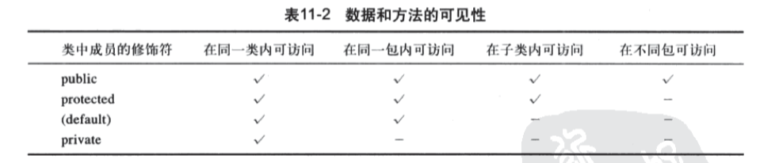

# Java语言程序设计-基础篇

[TOC]


# 第6章 一维数组

## Math类

Math.max()/min(), 重载了int, long, float, double.


## System.arraycopy()

java.lang.System

数组复制: System.arraycopy(sourceArray, src_pos, targetArray, tar_pos, length);


## Arrays类

java.util.Arrays

Arrays.sort(array, start, end) //end is inclusive

Arrays.binarySearch(array, num)  //返回下标,从0开始

Arrays.equals(array1, array2)  //返回boolean


# 第7章 多维数组

(略)


# 第8章 对象和类

**变量:**

- 类变量      	//只属于类的一个对象的变量
- 静态变量        //类的所有对象共享的变量

**常量:** final static

​	被该类的所有对象共享 

```java
final static double PI = 3.1415926
```

**可见性修饰符:**

public , 缺省 ,  private , protected

可以在 **类, 方法** 和 **数据域** 前面使用.

**public** 表示可以被任何其他的类访问.

**缺省** 表示可以被同一个包中的任何一个类访问, 也称作 **包私有** 或 **包内访问**

**private** 表示只能在它自己的类中被访问


# 第9章 字符串和文本I/O

**String:**

String对象不可变, 它的内容是不可改变的.

Java虚拟机为了提高效率并节约内存, 对具有相同字符串序列的**字符串直接量**使用同一个实例.


**字符串比较**

equals()

...

compareTo()


**获取子串**

substring(start)

substring(start, end)


**matches方法**

"Java is fun".matches("Java.*")  //返回true


**toCharArray()**


**由字符数组构造字符串**

new String(new char[]{'J', 'a','v','a'});

String的静态方法: valueOf


**StringBuilder/StringBuffer**

后者中修改缓冲区的方法是同步的,  除此之外, 两者是很相似的.

前者比后者更高效, 如果是单任务访问, 使用前者更有效.


# 第10章 关于对象的思考

**不可变对象和类**


# 第11章 继承和多态

**子类和父类的关系**: is a

**super**:用来调用父类的方法

**构造方法链:**调用子类对象构造函数的时候, 会先调用父类的构造函数, 一直往上..父类调用它的父类的构造函数..

**调用父类的方法**: super.method()

**覆盖和重载:**如果子类中定义的方法和父类中的同名方法的申明是一样的, 就是子类的方法覆盖父类的方法. 否则,如果申明不一样, 就是重载.

**面向对象3大特性: 封装\继承\多态**

需要传递一个父类对象作为参数的地方, 可以传递一个子类对象.  反过来不行. 子类是父类的特殊化, 携带了除了父类之外更多的信息.

**动态绑定**: 申明类型, 实际类型

**对象转换和instanceof运算符**: 隐式转换, 显式转换

**ArrayList**: add(), remove(), contains()

**protected修饰符**: 

在父类中用protedcted的数据域或方法,  在子类中仍然可以访问. 在同一包内也可以访问.



**防止类的扩展**: 类在定义的时候, 使用final关键字修饰.


# 第13章 异常处理


# 第14章 抽象类和接口

