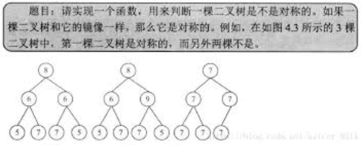

# 对称的二叉树



这道题, 书上直接给出, 如果是镜像的二叉树, 那么含有Null的先序遍历序列, 和含有Null的右序遍历序列, 是一样的.

书上定义了右序遍历: 先中, 再右, 后左.

可能会出现所有节点值都相等的非镜像二叉树. 因此需要加入Null节点.  

在java中是null, 在python中是None

```python
# -*- coding:utf-8 -*-
# class TreeNode:
#     def __init__(self, x):
#         self.val = x
#         self.left = None
#         self.right = None

class Solution:
    def isSymmetrical(self, pRoot):
        if not pRoot:
            return True
        lst1, lst2 = [], []
        self.preVisit(pRoot, lst1)
        self.postVisit(pRoot, lst2)
        return self.judge(lst1, lst2)
        
    def preVisit(self, pRoot, lst):  # 先序遍历, 包含None, 也就是空节点
        if not pRoot:   # 遍历到空节点 需要加入None
            lst.append(None)
            return
        lst.append(pRoot.val)
        self.preVisit(pRoot.left, lst)
        self.preVisit(pRoot.right, lst)
        
    def postVisit(self, pRoot, lst):  # 右序遍历, 自己定义的, 顺序是: 中-右-左
        if not pRoot:   # 遍历到空节点 需要加入None
            lst.append(None)
            return
        lst.append(pRoot.val)
        self.postVisit(pRoot.right, lst)
        self.postVisit(pRoot.left, lst)
        
    def judge(self, lst1, lst2):
        for i,j in zip(lst1, lst2):
            if i != j:
                return False
        return True   #判断2个列表是否相同
```

