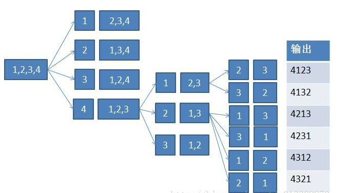

# 打印从1到最大的的n位数

[TOC]

题目:输入数字n, 按顺序打印出从1到最大的n位十进制数. 比如输入3, 则打印出1, 2, 3, ... , 999.


可能的输入:

-3, 0, 3, 9, 12

非法输入, 边界值, 比较大的数.


## 普通解法-字符串模拟加法

```java
package question17;

public class Solution {

	/**
	 * @param args
	 */
	public static void main(String[] args) {
		// TODO Auto-generated method stub
		printOneToN(10);
	}
	
	public static void printOneToN(int n){
	    int[] num = new int[n];
	    
	    int printTimes = (int)(Math.pow(10, n)-1);
	    while(printTimes--!=0){
	        addOne(num);
	        printNum(num);
	    }
	        
	}

	public static void addOne(int[] num){
	    for(int j=num.length-1; j>=0; j--){
	        if(num[j] != 9){
	            num[j] = num[j]+1;
	            break;
	        }else{
	            num[j] = 0;
	        }
	    }
	}

	public static void printNum(int[] num){
	    boolean meetFirst = false;
	    StringBuilder str = new StringBuilder();
	    for(int c: num){
	        if(meetFirst)
	        	str.append(c);
	        else if(c != 0){
	                meetFirst = true;
	                str.append(c);
	        }
	    }
	    System.out.println(str);
	}

}

```


## 高级解法-全排列解法

参考:https://blog.csdn.net/u013309870/article/details/68941284



```java
public static void printOneToN(int n){
    	if(n<=0)
            return;
		int[] array = new int[n];
		for(int i=0; i<=9; i++){
	        helper(array, i, 0);
		}
	}
	//cur是当前位的数字, i是当前位的下标
	public static void helper(int[]array, int cur, int i){
	    if(i==array.length-1){  //终止条件
	    	array[i] = cur;
	        printNum(array);
	    }else{
	    	array[i] = cur;
	        for(int n=0; n<=9; n++){
	            helper(array, n, i+1);
	        }
	    }
	}

	public static void printNum(int[] array){
	    StringBuilder s = new StringBuilder();
	    boolean first = true;
	    for(int n:array){
	    	if(first && n!=0){
	            s.append(n);
	            first = !first;
	    	}else if(!first){
	            s.append(n);
	        }
	    }
	    if(!first)   //数组不全为0
	    	System.out.println(s);
	}
```

