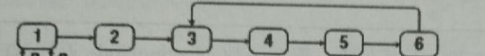

# 链表中环的入口节点

如果一个链表中包含环, 如何找出环的入口节点? 




**思路**1

先判断链表是否有环, 快慢指针, 找到处于环中的一个节点pa...

再计算环中节点个数: 从pa开始, 绕环遍历一圈, 直到再次回到pa, 可以得到环中节点个数n

最后找环的入口节点: 使用2个指针, 快指针先走n步, 然后每次各走一步, 直到快慢指针相遇, 相遇的节点就是环的入口节点.

## java解法

```java
public static ListNode HasLoop(ListNode head){
    if(head==null)
        return null; //注意异常处理
    ListNode quick=head, slow=head;
    while(quick!=null){
        if(quick.next != null && quick.next.next!=null){
            quick = quick.next.next;
            slow = slow.next;
        }else
            return null;   //链表无环.
        if(quick == slow)
            return quick;
    }
    return null;
}//如果有环, 返回一个位于环中的节点, 如果没有环, 则返回null

public static ListNode EntryNodeOfLoop(ListNode head){
    ListNode nodeInLoop = HasLoop(head);  //判断是否有环, 如果有环, 得到一个处于环中的节点.
    if(nodeInLoop==null)
        return null;   //没有环, 返回null
    
    ListNode pNode = nodeInLoop.next;
    int nodeNum = 1;
    while(pNode!=nodeInLoop){
        pNode = pNode.next;
        nodeNum++;
    }  //计算环中节点的个数nodeNum
    
    pNode = head;
    ListNode pNodeSlow = head;
    for(int i=0; i<nodeNum; i++){
		pNode = pNode.next;
    }  //指针pNode从头开始, 多走nodeNum个节点.  pNodeSlow从头开始.
    
    while(pNode != pNodeSlow){
        pNode = pNode.next;
        pNodeSlow = pNodeSlow.next;
    }//每步走一个节点, 知道相遇, 相遇的节点就是环的入口.
    
    return pNode;
}
```


## Python解法:

```python
# -*- coding:utf-8 -*-
# class ListNode:
#     def __init__(self, x):
#         self.val = x
#         self.next = None
class Solution:
    def EntryNodeOfLoop(self, head):
        nodeInLoop = self.HasLoop(head)
        if nodeInLoop == None:
            return None
        
        pNode = nodeInLoop.next
        cnt = 1
        while pNode is not nodeInLoop:
            pNode = pNode.next
            cnt += 1 
        
        pNode = head
        pNodeSlow = head
        for i in range(cnt):
            pNode = pNode.next
        
        while pNode is not pNodeSlow:
            pNode = pNode.next
            pNodeSlow = pNodeSlow.next
        
        return pNode
        
	def HasLoop(self, head):
		if head==None:
			return None  #空链表
		quick = head
		slow = head
		while quick != None:
			if quick.next != None and quick.next.next != None:
				quick = quick.next.next
				slow = slow.next
			else:
				return None
			if quick is slow:
				return quick
		return None
```

注意对2个对象进行比较判断时, is 和 ==的区别

is比较的是对象的id

==比较对象的value是否相等.


对于字符串直接量, 相同的字符串直接量, id也相同, python中字符串是否不当作对象处理? 或跟java中一样, 同一个字符串直接量, 共享相同的存储空间.