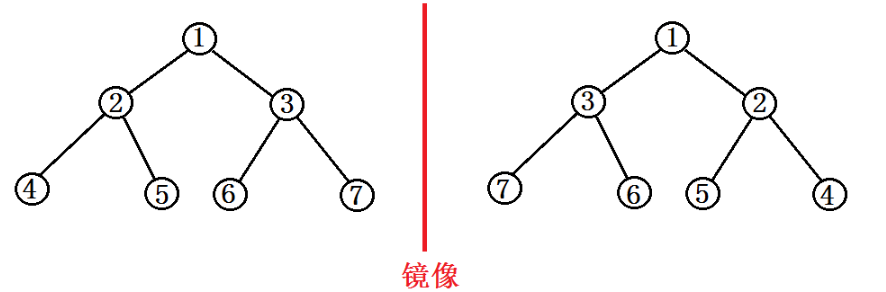

# 二叉树的镜像

题意:

给定一颗二叉树, 要求得到这颗二叉树的镜像树.

镜像树, 就是从根节点起, 对于每个父节点, 如果有一个或多个左右孩子节点, 就交换左右孩子节点.  递归到叶子结点..



**思想**1

递归解法:

```python
# -*- coding:utf-8 -*-
# class TreeNode:
#     def __init__(self, x):
#         self.val = x
#         self.left = None
#         self.right = None
class Solution:
    # 返回镜像树的根节点
    def Mirror(self, root):
        # write code here
        if root:
            if root.left or root.right:
                tmp = root.left
                root.left = root.right
                root.right = tmp
            if root.right:  //此题, 先递归对左孩子做镜像和先递归对右孩子做镜像, 都行...
                self.Mirror(root.right)
            if root.left:
                self.Mirror(root.left)
        return root
```

