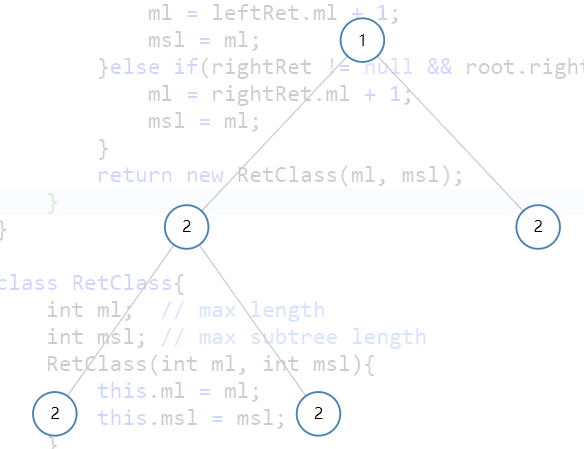
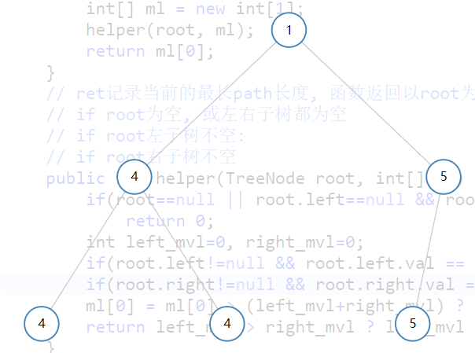

687. Longest Univalue Path 


https://leetcode.com/submissions/detail/166949403/

http://zxi.mytechroad.com/blog/tree/leetcode-687-longest-univalue-path/


代码:

```java
/**
 * Definition for a binary tree node.
 * public class TreeNode {
 *     int val;
 *     TreeNode left;
 *     TreeNode right;
 *     TreeNode(int x) { val = x; }
 * }
 */
class Solution {
    
    public int longestUnivaluePath(TreeNode root){
        int[] ml = new int[1];
        helper(root, ml);
        return ml[0];
    }
    
    // ml(max length)数组记录当前的最长path长度, 函数返回以root为路径端点, 最长路径长度mvl(max vertical length)
    // if root为空, 或左右子树都为空
    // if root左子树不空: 
    // if root右子树不空
    public int helper(TreeNode root, int[] ml) {
        if(root==null || root.left==null && root.right==null)
            return 0;
        int left_mvl=0, right_mvl=0;
        if(root.left!=null){
        	left_mvl = helper(root.left, ml)+1;  //当左子树不为空时, 为了更新ml[0], helper必须执行一次, 右子树不空时一样
        	if(root.left.val!=root.val) left_mvl=0;
        }
        if(root.right!=null){
        	right_mvl = helper(root.right, ml)+1; 
        	if (root.right.val != root.val) right_mvl=0;
        }
        ml[0] = ml[0] > (left_mvl+right_mvl) ? ml[0] : (left_mvl+right_mvl); //更新ml[0]
        return left_mvl > right_mvl ? left_mvl : right_mvl; //返回mvl
    }
}
```


case1:



