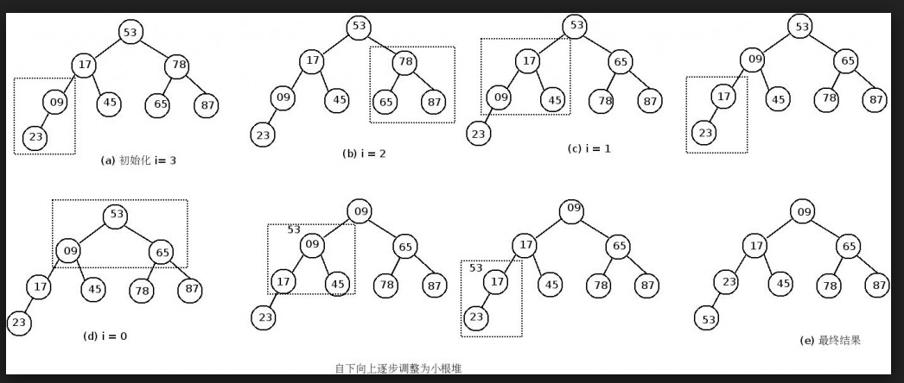
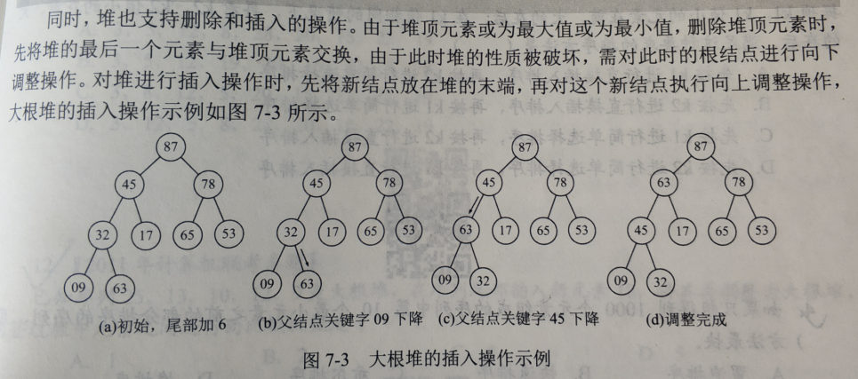

# 大小根堆

**堆的定义**: n个关键字序列L[1...n]称为堆, 当且仅当该序列满足:

- L[i]<=L[2i] 且L[i]<=L[2i+1]
- L[i]>=L[2i] 且L[i]>=L[2i+1]

满足第一种情况的称为小根堆, 满足第二种情况的称为大根堆.

堆是一棵**完全二叉树**.

其实, 堆就是把一个数组当成一棵完全二叉树, 某个数组元素L[i]如果有左右孩子,分别是L[2i], L[2i+1].

堆适合用于顺序存储.


**堆的操作**有:(以大根堆为例)

- 建立堆

	- 如何调整: 由树的性质可以知道, 堆是n个关键字序列L[1...n], 第n个元素, 是第int(n/2)个元素的叶子结点. 对第int(n/2)个元素为根的子树进行筛选, (若根节点的关键字小于左右孩子中较大者, 则交换). 之后向前依次对[int(n/2)~1]为根的子树进行筛选.

	- 对于依次筛选: 对某个结点为根的子树进行筛选, 可能破坏以其左右孩子为根的子树的堆的性质(向下调整的结点, 可能还需要继续向下调整...直到放置到合适的位置(左右孩子都小于该节点), 或直到调整到叶节点)

		

	

- 插入元素

	- 先将一个数据元素插入到堆的尾部(数组末端], 再将该结点逐层向上调整, 知道依然构成一个堆, 调整方法是看每个子树是否符合大根堆的特征, 不符合的话则交换叶子结点和根的位置. 交换之后, 以叶子结点为根的子树可能又不满足堆的性质, 这时候又要向下调整, 直到叶子结点.

- 删除堆顶元素

	堆中的元素只能从**堆顶删除**.




## 大根堆

由数组建立大根堆: 为了方便表示节点的孩子节点, heap[0]不存放元素, 这样heap[i]的孩子节点就是heap[2i], heap[2i+1]

```java
/*
* 由数组建立堆
* heap[0]用来暂存元素, 不属于堆, 堆从heap[1]开始存放, len是数组长度-1;
*/
public static void buildMaxHeap(int[] heap, int len){
    for(int i=len/2; i>0; i--){
        adjustDown(heap, i, len);
    }
}

//自上而下调整堆
public static void adjustHeap(int[] heap, int k, int len){
    heap[0] = heap[k];
    for(int i=2*k; i<=len; i*=2){
        if(i<len && heap[i] < heap[i+1]) i++;
        if(heap[0] >= heap[i]) break;
        else{
            heap[k] = heap[i];
            k=i;
        }
    }
    heap[k] = heap[0];
}
```

堆的插入:


堆的删除:


堆排序:

```java
/*
* 大根堆排序, heap[0]用来暂存元素, len是数组长度-1.
*/
public static void heapSort(int[] heap, int len){
    buildMaxHeap(heap, heap.length-1);
    for(int i=len; i>1; i--){
        int tmp = heap[i];
        heap[i] = heap[1];
        heap[1] = tmp;
        adjustDown(heap, 1, i-1);
    }
}
```

