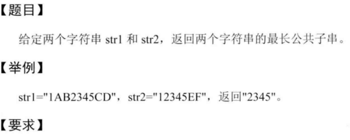
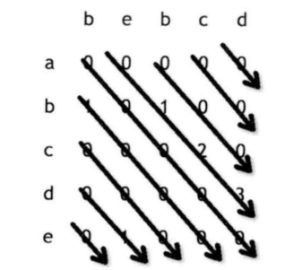

4-最长公共子串问题



明显的一道动态规划的题目, 定义状态转移矩阵:

## 时间空间均为O(M*N)的解法:

```
int[][] dp = new int[str1.length()+1][str2.length()+1];
//dp[i][j]定义为以i结尾的str1的子串,和以j结尾的str2的子串的最长公共子串长度.
```


```
public class Solution {
    /**
     * @param A: A string
     * @param B: A string
     * @return: the length of the longest common substring.
     */
    public int longestCommonSubstring(String A, String B) {
        if(A.length()==0 || B.length()==0)
            return 0;
        char[] charA = A.toCharArray();
        char[] charB = B.toCharArray();
        int[][] dp = new int[charA.length+1][charB.length+1];
        int max = 0;
        for(int i=1; i<=charA.length; i++){
            for(int j=1; j<=charB.length; j++){
                if(charA[i-1]==charB[j-1])
                    dp[i][j] = dp[i-1][j-1] + 1;
                else
                    dp[i][j] = 0;
                max = Math.max(max, dp[i][j]);
            }
        }
        return max;
    }
}
```


## 时间O(M*N),空间O(1)的解法:



每次遍历一条斜线, 只需O(1)空间.

```java
public class Solution {
    /**
     * @param A: A string
     * @param B: A string
     * @return: the length of the longest common substring.
     */
    public int longestCommonSubstring(String A, String B) {
        //时间O(M*N), 空间O(1)的解法
        
        int max = 0, curlen = 0;
        char[] charA = A.toCharArray();
        char[] charB = B.toCharArray();
        int i, j, curi, curj;
        for(i=0; i<charA.length; i++){
            curi=i; curj=0; curlen = 0;
            while(curi<charA.length && curj<charB.length){
                if(charA[curi++]==charB[curj++])
                    curlen += 1;
                else
                    curlen = 0;
                max = Math.max(max, curlen);
            }
        }
        for(j=1; j<charB.length; j++){
            curi=0; curj=j; curlen=0;
            while(curj<charB.length && curi<charA.length){
                if(charA[curi++]==charB[curj++])
                    curlen += 1;
                else
                    curlen = 0;
                max = Math.max(max, curlen);
            }
        }
        return max;
    }
}
```

