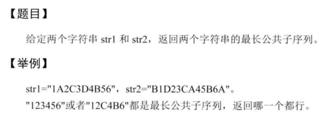

# 4-最长公共子序列



[传送门](https://www.lintcode.com/problem/longest-common-subsequence/description)

代码有点啰嗦:

动态规划题, 定义dp\[i\]\[j\]为str1[0,...i]和str2[0...j]的最长公共子序列长度.

dp[i\][j]=max{dp[i\][j-1], dp[i-1\][j], <dp[i-1]\[j-1]+1>}, 如果str1[i] = str2[j] 才有第3项.

```
public class Solution {
    /**
     * @param A: A string
     * @param B: A string
     * @return: The length of longest common subsequence of A and B
     */
    public int longestCommonSubsequence(String A, String B) {
        if(A.equals("") || B.equals(""))
            return 0;
        char[] charA = A.toCharArray();
        char[] charB = B.toCharArray();
        int[][] dp = new int[charA.length][charB.length];
        int maxLen = 0;
        for(int i=0; i<charA.length; i++){
            if(maxLen==0 && charA[i]==charB[0]) maxLen = 1;
            dp[i][0] = maxLen;
        }
        maxLen = 0;
        for(int j=0; j<charB.length; j++){
            if(maxLen==0 && charB[j]==charA[0]) maxLen=1;
            dp[0][j] = maxLen;
        }
        int max = 0;
        for(int i=1; i<charA.length; i++){
            for(int j=1; j<charB.length; j++){
                max = dp[i][j-1];
                max = Math.max(max, dp[i-1][j]);
                if(charA[i]==charB[j])
                    max = Math.max(max,dp[i-1][j-1] + 1);
                dp[i][j] = max;
            }
        }
        return dp[charA.length-1][charB.length-1];
    }
}
```

