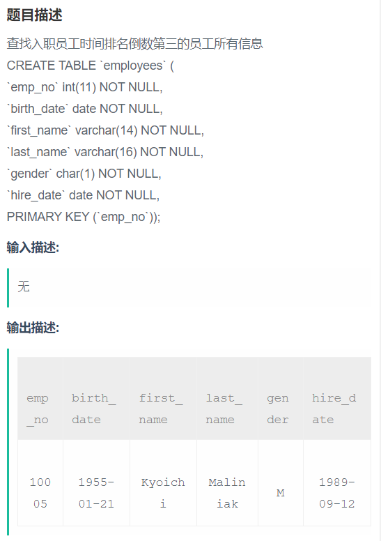

# 查找入职员工时间排名倒数第三的员工所有信息 




入职时间排倒数第三的，可能有多个人。根据hire_date倒序排名，选择排第三的hire_date

```sql
select * from employees where hire_date = (select **distinct** hire_date from employees **order by** hire_date desc **limit 2,1**);
```


知识点提炼：

distinct关键字，用来去掉重复的，选择非重复的hire_date按降序排名倒数第三的那一天；

order by...desc 用来按hire_date的降序排序;

limit m,n 用来从第m+1个开始，选择n条记录；

