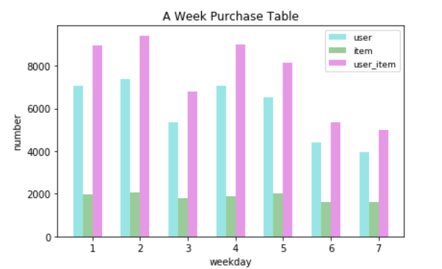
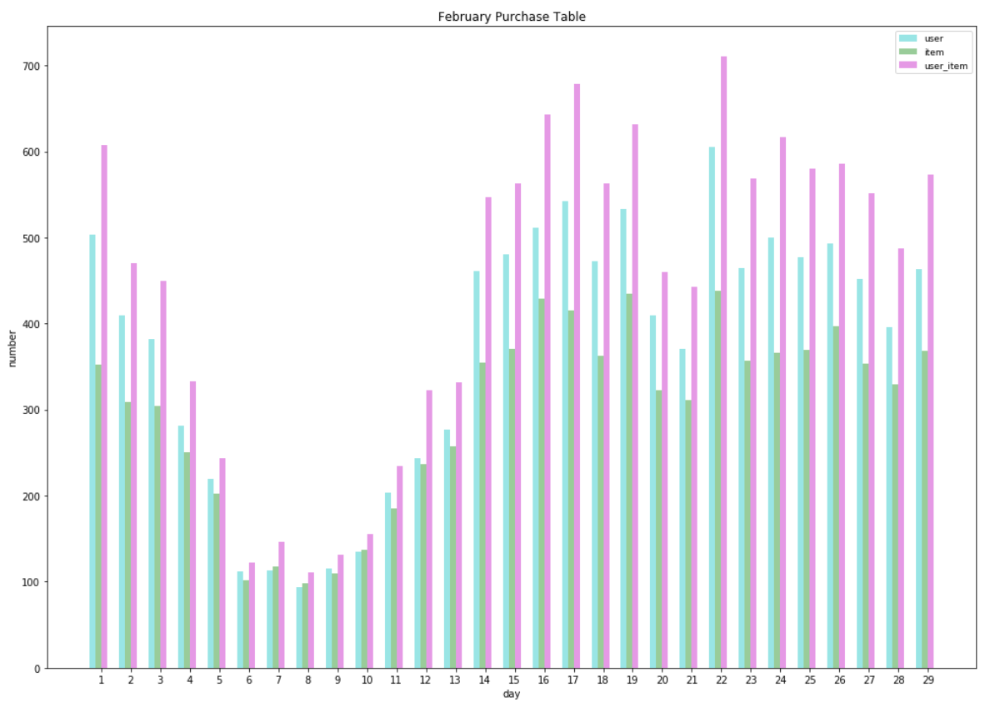

数据挖掘过程


为了快速验证自己的想法, 一般会从原始数据中抽取一部分作为样本.

为了避免读取大量数据的时候, 造成Memory Error, 使用pandas分块读取.


## 数据分析:

### 分析一周内的购买情况

将所有数据缩小到周一到周日, 统计每天的购买用户个数\购买商品个数\购买记录条数; 分析周一到周日的购买情况分布. 发现除了周末2天购买数量稍少, 没有明显的规律.



### 分析一个月内的购买情况

分析2016年2月的数据



2月6日到10日之间是农历新年, 数据异常, 在实际分析时, 可以暂时将这部分数据作为异常数据不去考虑.不加入我们的训练样本中


### 查看特定用户对特定商品的活动轨迹

```
          user_id  sku_id  type                 time
343324      62969   62655     6  2016-02-01 11:00:05
466133      62969   62655     6  2016-02-01 11:00:05
12296       62969   62655     1  2016-02-01 11:00:05
368899      62969   62655     6  2016-02-01 11:00:05
12307       62969   62655     1  2016-02-01 11:00:05
12300       62969   62655     2  2016-02-01 11:00:18
261314      62969   62655     6  2016-02-01 11:00:35
12305       62969   62655     1  2016-02-01 11:00:49
12285       62969   62655     1  2016-02-01 11:00:49
12302       62969   62655     2  2016-02-01 11:02:16
466127      62969   62655     6  2016-02-01 11:02:17
12294       62969   62655     1  2016-02-01 11:02:17
261313      62969   62655     6  2016-02-01 11:02:17
12304       62969   62655     1  2016-02-01 11:02:17
343325      62969   62655     6  2016-02-01 11:02:17
368885      62969   62655     6  2016-02-01 11:02:17
12306       62969   62655     1  2016-02-01 11:03:47
12297       62969   62655     1  2016-02-01 11:03:47
12303       62969   62655     4  2016-02-01 11:04:00
4191069     62969   62655     1  2016-02-11 22:06:03
4191073     62969   62655     1  2016-02-11 22:06:03
4447973     62969   62655     6  2016-02-11 22:06:03
4510961     62969   62655     6  2016-02-11 22:06:03
4543335     62969   62655     6  2016-02-11 22:06:03
8687966     62969   62655     6  2016-03-07 21:09:02
9000609     62969   62655     6  2016-03-07 21:09:02
7853926     62969   62655     1  2016-03-07 21:09:02
8543227     62969   62655     6  2016-03-07 21:09:02
7853923     62969   62655     1  2016-03-07 21:09:02
7853921     62969   62655     2  2016-03-07 21:09:20
...           ...     ...   ...                  ...
9065459     62969   62655     6  2016-03-07 21:09:32
7853924     62969   62655     1  2016-03-07 21:09:32
7853922     62969   62655     4  2016-03-07 21:10:00
2211646     62969   62655     1  2016-03-13 20:32:35
2211627     62969   62655     1  2016-03-13 20:32:35
2783228     62969   62655     6  2016-03-13 20:32:35
3020741     62969   62655     6  2016-03-13 20:32:35
2429546     62969   62655     6  2016-03-13 20:32:35
2686932     62969   62655     6  2016-03-13 20:32:35
3703567     62969   62655     1  2016-03-14 00:31:20
4595705     62969   62655     6  2016-03-14 00:31:20
4823957     62969   62655     6  2016-03-14 00:31:20
5083452     62969   62655     6  2016-03-14 00:31:20
4366952     62969   62655     6  2016-03-14 00:31:20
3703576     62969   62655     1  2016-03-14 00:31:20
18845154    62969   62655     6  2016-03-25 17:28:34
19033716    62969   62655     6  2016-03-25 17:28:34
19241456    62969   62655     6  2016-03-25 17:28:34
18326405    62969   62655     1  2016-03-25 17:28:34
18326391    62969   62655     1  2016-03-25 17:28:34
19241470    62969   62655     6  2016-03-25 17:32:25
19033715    62969   62655     6  2016-03-25 17:32:25
18765578    62969   62655     6  2016-03-25 17:32:25
18326406    62969   62655     1  2016-03-25 17:32:25
18326393    62969   62655     1  2016-03-25 17:32:25
19336316    62969   62655     6  2016-03-25 17:32:25
19328644    62969   62655     6  2016-03-25 17:32:57
18765559    62969   62655     6  2016-03-25 17:34:36
5214356     62969   62655     1  2016-04-05 18:49:11
5931057     62969   62655     6  2016-04-05 18:49:11

[61 rows x 4 columns]
```

由于我们需要预测16-20号五天用户的购买情况,那我们不妨分析下用户以5天为单位(周期为5)购买情况. 

预测数据部分: 2016-04-16到2016-04-20用户是否下单P中的商品，每个用户只会下单一个商品； 


### 探索高潜用户的行为

比赛的题目是高潜用户购买意向预测, 那么理解清楚**什么是高潜用户**对于数据分析,特征抽取,以及之后的建立模型有着至关重要的作用. 简单来讲,作为训练集的高潜用户应该具有以下特征: 

- 必须有购买行为
- 对一个商品购买和其他交互行为(浏览,点击,收藏等)时间差应该**多于一天**
	因为根据赛题,我们需要预测未来5天的购买情况,那么如果用户对某商品在同一天完成所有的交互行为(包括购买),
	我们无法从这种交易中指导未来的预测.
	**更新Note**: 可能存在买了又买的情况，这部分用户也不可忽略.


### 寻找具有购买记录的用户

的一个文件夹中寻找有购买记录的用户-商品对

找出有购买记录的用户，并写到csv文件

