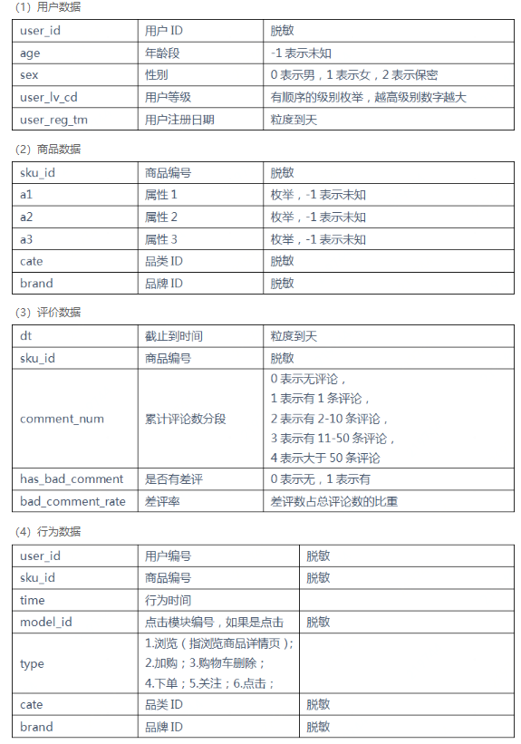

赛题分析

预测在未来5天内, 对某个目标品类下商品的购买意向 :

1. 用户是否购买候选集中商品
2. 如果预测为用户购买了候选集中商品, 则需预测购买的商品编号:sku_id

对于1中, 如果预测正确, 则测试平台会将label标为1, 预测错误标为0.

对于2中,如果预测正确, 测试平台会将pred标为1, 预测错误标为0.

1的F1值设为$F1_1$, 2的F1值设为$F1_2$.

score = $0.4*F1_1 + 0.6*F1_2$

数据分析

一共有4张表: 用户数据、商品数据、评价数据、行为数据。

