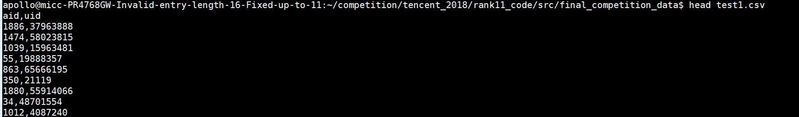
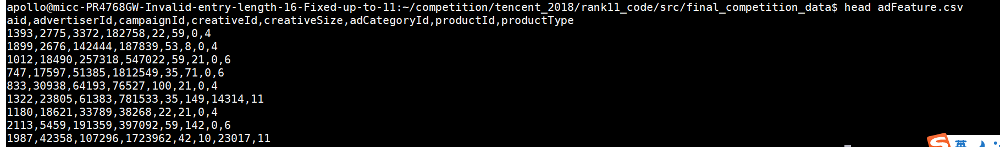

https://github.com/liupengsay/2018-Tencent-social-advertising-algorithm-contest/tree/master/%E5%84%BF%E9%A1%BB%E6%88%90%E5%90%8D%E9%85%92%E9%A1%BB%E9%86%89_v2

## 赛题介绍

相似人群拓展(Lookalike)的工作机制是基于种子用户画像和社交关系链寻找出相似用户.

Lookalike技术, 设计基于种子用户画像和关系链寻找相似人群, 即根据种子人群的共有数学进行自动化扩展, 以扩大潜在用户覆盖面, 提升广告效果. 具体来讲, 种子包里包含有广告主提交的一批已知种子用户, 可以当作机器学习问题中的正样本. 广告平台中有海量的非种子用户, 也有大量的广告投放历史数据, 可以帮助生成正负样本. 有了正负样本后, 相似人群拓展就变成了一个机器学习问题中的二分类问题. 在线上使用中, 广告平台可以依据二分类模型算出的后验概率来判定候选用户与种子包里用户的相似程度, 最后将相似度最高的一批候选用户作为最终的结果.Lookalike相似人群拓展和广告CTR有些类似.

## 特征构造

五大类特征: 投放量(click), 投放比例(ratio), 转化率(cvr), 特殊转化率(CV_cvr), 多值长度(length).

## 1.数据合并,数据集构造-final_merge.py

复赛数据集解压后, 一共有5个数据表:

userFeature.data是用户信息数据:

test1.csv是第一阶段测试集

test2.csv的第二阶段测试集

adFeature.csv广告信息数据:

train.csv用户-广告点击历史记录:

先把userFeature.data文件转换为.csv文件, 但是由于太大, 不能一次性转换成功, 必须读取一部分, 转换一部分:

数据集比较大时, 使用python的原始数据结构会比较快一点, 使用一个字典存放每一条记录的各个字段, 用一个列表存放所有记录. userFeature.data中大概有4500W+条记录.

接下来将训练集\测试集1\测试集2都分别打上标记, 然后合并成一个数据表.

将刚才concat得到的data表, 与广告信息数据ad_feature进行左连接, 再与用户信息数据user_feature进行左连接, 得到合并的数据集.

对缺失值进行-1填充. 

将用户-广告点击历史数据集中, 各条广告的正负样本平均分成5份, 将n_parts=1用作验证集, n_parts=2~5用作训练集;

n_parts=6~7为测试集1和测试集2:

分别保存各个part的index, 数据统一保存到data.csv中.

## 2.特征转换

读取所有数据(包含训练集\验证集\测试集), 分别提取训练集,验证集,测试集的index, 以及训练集的label, 验证集的label

对单值特征进行编码

ct是运营商编号, 是个多值特征, 对ct进行手工one_hot编码:

将单值特征进行Onehot编码转换:

一共分3组, 分组方便后序进行特征组合, 特征选取;

以第一组为例, 另外2组操作相似, 省略

将多值特征进行CountVectorizer转换, 变成稀疏编码数据;

分2组进行.

第一组, 处理interest5之外的特征, interest5单独处理.

单独处理interest5:

