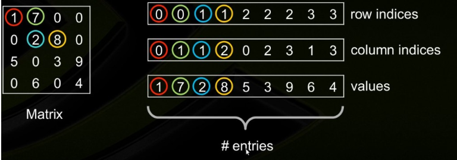
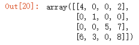
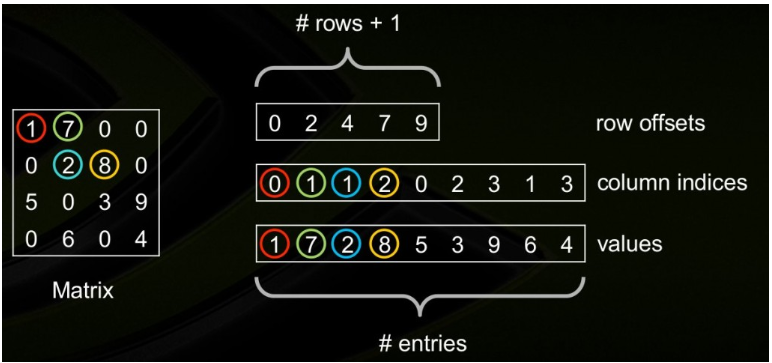
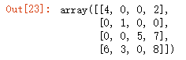
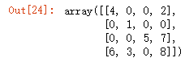
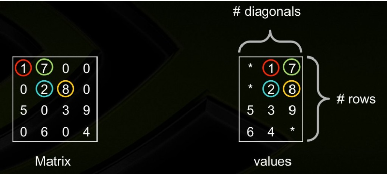

# sparse_matrix

[TOC]

## python稀疏矩阵操作

### sparse matrix的保存和读取

```python
from scipy import sparse
sparse.save_npz('./filename.npz', csr_matrix_variable)  #保存
csr_matrix_variable = sparse.load_npz('path.npz')
```

### sparse matrix的横向合并

```python
sparse.hstack(...)
```


## COO-CSR-CSC格式

### COO(Coordinate Format)

COO是一种坐标形式的稀疏矩阵。采用三个数组row、col和data保存非零元素的信息，这三个数组的长度相同，row保存元素的行，col保存元素的列，data保存元素的值。存储的主要优点是灵活、简单，仅存储非零元素以及每个非零元素的坐标。但是COO不支持元素的存取和增删，一旦创建之后，除了将之转换成其它格式的矩阵，几乎无法对其做任何操作和矩阵运算。 

COO使用3个数组进行存储：values,rows, andcolumn。 

其中

数组values: 实数或复数数据，包括矩阵中的非零元素，顺序任意。

数组rows: 数据所处的行。

数组columns: 数据所处的列。

参数：矩阵中非零元素的数量 nnz，3个数组的长度均为nnz. 




```python
import scipy
import numpy as np
row_idx = np.array([0,0,1,2,2,3,3,3])
col_idx = np.array([0,3,1,2,3,0,1,3])
values = np.array([4,2,1,5,7,6,3,8])
coo_mat = scipy.sparse.coo_matrix((values, (row_idx,col_idx)), shape=(4,4)).toarray()
coo_mat
```




### CSR(Compressed Sparse Row Format)

压缩稀疏行格式(CSR)通过四个数组确定： values,columns, rows

其中

数组values：是一个实（复）数，包含矩阵A中的非0元，以行优先的形式保存；数组columns：第i个整型元素代表矩阵A中第i列；

数组rows: 最后一个数表示数组中有多少个非零元素, 之前的第i个数, 表示矩阵第i行第一个非零元素在values中的下标.



```python
import scipy
import numpy as np
row_ptr = np.array([0,2,3,5,8])
col_idx = np.array([0,3,1,2,3,0,1,3])
values = np.array([4,2,1,5,7,6,3,8])
csr_mat = scipy.sparse.csr_matrix((values, col_idx, row_ptr), shape=(4,4)).toarray()
csr_mat
```




### CSC(Compressed Sparse Column Format)

压缩稀疏列格式(CSC)类似CSR格式，只是用的是列而不是行压缩。换句话说，矩阵A的CSC 格式和矩阵A的转置的CSR是一样的。 

同样CSC也是由四个数组确定：values, columns, pointerB, and pointerE. 含义类同CSR。 

```python
import scipy
import numpy as np
col_ptr = np.array([0,2,4,5,8])
row_idx = np.array([0,3,1,3,2,0,2,3])
values =  np.array([4,6,1,3,5,2,7,8])
csc_mat = scipy.sparse.csc_matrix((values, row_idx, col_ptr), shape=(4,4)).toarray()
csc_mat
```



### DIA

如果稀疏矩阵有仅包含非0元素的对角线，则对角存储格式(DIA)可以减少非0元素定位的信息量。这种存储格式对有限元素或者有限差分离散化的矩阵尤其有效。

DIA通过两个数组确定： values、distance。

其中values：对角线元素的值；

distance：第i个distance是当前第i个对角线和主对角线的距离。



