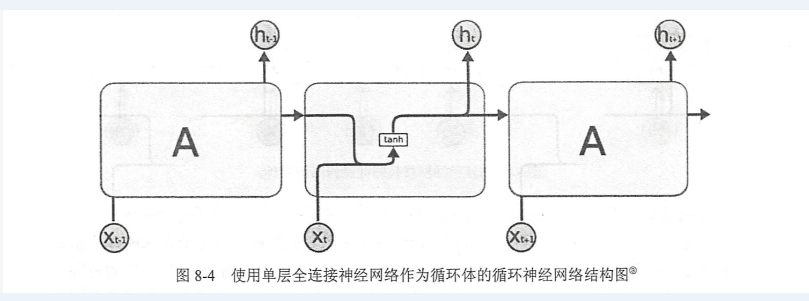
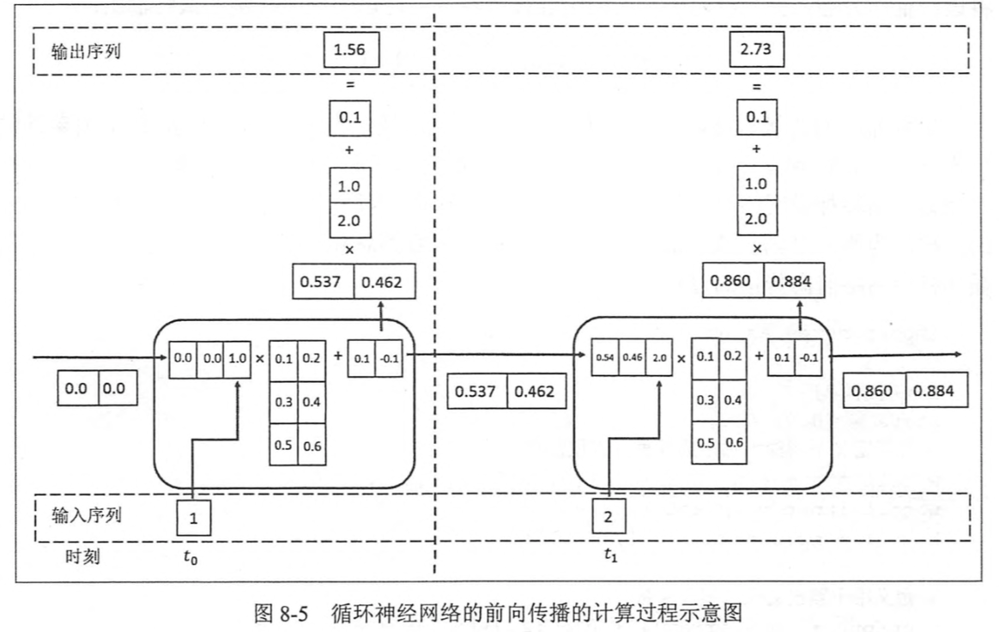

# RNN基础

循环神经网络:

参考《Tensorflow实战Google深度学习框架》 P200

假设输入向量维度为x, 循环神经网络的状态向量维度为h, 那么网络中参数的个数为(h+x)*h + h个.

## 网络结构

## 前向传播的计算过程：

该网路输入参数维度x=1, 状态向量维度为h=2, RNN参数个数为(h+x)*h+h=(2+1)\*2+2 = 8个. 全连接层参数2+1=3个.

前向传播的详细过程见《Tensorflow实战Google深度学习框架》 P203.

