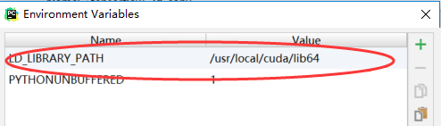

## Index:

#### tensorFlow实战google深度学习框架

- chapter3 入门
- chapter4 深层神经网络
- chapter5 MNIST数字识别


#### tensorflow examples:

次文件夹存放我的学习代码

- 参考github教程: https://github.com/aymericdamien/TensorFlow-Examples


### Resources:

#### References Books:

- TensorFlow实战google深度学习框架
- TensorFlow实战
- 机器学习实用指南


### links

W3Cschool:  https://www.w3cschool.cn/tensorflow_python/tensorflow_python-xp3r2dl5.html


## Tensorflow学习资料收集

[一个台湾人写的 tensorflow 學習筆記 记录30天的学习过程, 在第30天给出了入门建议](https://ithelp.ithome.com.tw/users/20103494/ironman/1231)

[Tensorflow-101](https://github.com/c1mone/Tensorflow-101)

[史上最全的Tensorflow学习资源汇总](http://www.tensorflownews.com/2018/04/10/tensorflowdatasets/)

[github TensorFlow-Examples](https://github.com/aymericdamien/TensorFlow-Examples)

[Awesome-TensorFlow-Chinese](https://github.com/fendouai/Awesome-TensorFlow-Chinese/)


## 设置使用GPU

### 设置gpu按需分配

当程序执行完毕后, gpu资源会被释放:

```python
config = tf.ConfigProto()
config.gpu_options.allow_growth = True
sess = tf.Session(config=config)
```

### 固定指定GPU

```PYTHON
import os
os.environ['CUDA_VISIBLE_DEVICES'] = '0'
```


Pycharm 导入tensorflow错误的解决办法, 设置Pycharm中cuda的环境变量...



[PyCharm ImportError: libcusolver.so.8.0: cannot open shared object file: No such file or directory 解决办法](https://www.cnblogs.com/keyky/p/8075483.html)

