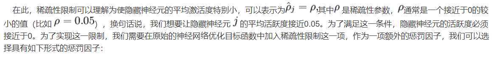
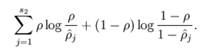
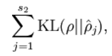
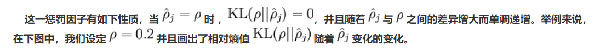
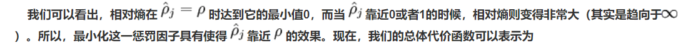
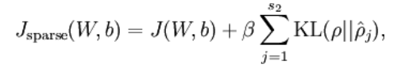
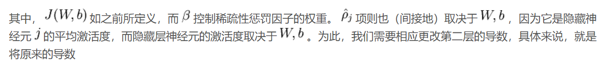
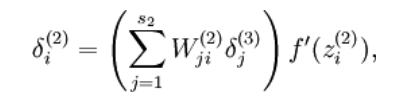
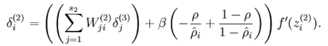
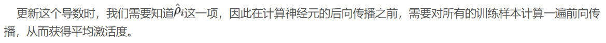

# 降维 

[TOC]

Embedding

稀疏自编码器 Sparse Autoencoder

10.45

# 稀疏自编码器  Sparse Autoencoder

## 稀疏自编码器基础(1)

**以下内容参考**:https://blog.csdn.net/u010278305/article/details/46881443

稀疏自编码器是具有一层隐含层的神经网络, 其思路是让输出等于输入, 即$y^{(i)}=x^{(i)}$, 其中$\{x^{(1)},x^{(2)},x^{(3)},...\}$表示训练样本集合, 让编码器自己发现输入数据中隐含的特征, 自编码神经网络的结果如下图:

当隐藏层神经元数目少于输入的数目时, 自编码神经网络可以达到数据压缩的效果.最终我们可以用隐藏神经元替代原始输入, 输入层的n个输入转换为隐藏层的m个神经元, 其中n>m, 之后隐藏层的m个神经元又转换为输出层的n个输出, 其输出等于输入. 当隐藏神经元数目较多时, 我们仍然可以对隐藏层的神经元加入稀疏性限制来发现输入数据的有趣结构.

10.58

理解: 在训练一个机器学习模型时, 我们希望输入的数据的每个属性的取值差异性越大越好, 以决策树模型来说, 这样更容易发现最优拆分特征.  如果取值都比较均匀, 分布范围较集中, 那么属性值对样本的区分度比较小, 信息熵比较小, 信息增益??

理解:对于一个指定的神经元, 它的**活跃度**, 是它的输出对所有训练数据取平均.

其中$s^2$是隐藏层中神经元的数量, 而索引 $j$ 依次代表隐藏层中的每一个神经元, 该表达式也可以描述为相对熵, 记为:

其中, $KL(\rho || \widehat{\rho}_j) = \rho log \frac {\rho} {\widehat{\rho}_j} + (1-\rho)log\frac{1-\rho}{1-\widehat{\rho}_j}$ 是一个以$\rho$为均值和一个以$\widehat{\rho}_j$为均值的两个伯努利随机变量之间的相对熵, 相对熵是一种标准的用来测量两个分布之间差异的方法.

换成如下的形式 

11.31

## 稀疏自编码器-tensorflow实现

