# 机器学习基础(1)-线性回归

给定由$d$个属性描述的示例$x=(x_1,x_2,...,x_d)$,其中$x_i$是$x$在第$i$个属性上的取值，线性回归试图学得一个通过属性的线性组合来进行预测的函数，即 

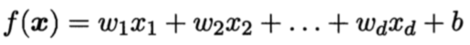

一般用向量形式写成， 

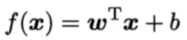

其中，$w=（w1;w2;...;wd）$。$w和b$学得之后，模型就得以确定。 

给定数据集$D={(x1,y1),(x2,y2), ... ,(xm,ym)}，其中，xi=(xi1;xi2;...;xid)，yi∈R$。“线性回归”（linear regression）试图学得一个线性模型以尽可能准确的预测实际输出标记。 

------

我们先考虑一种最简单的情况：输入属性的数目只有一个。线性回归试图学得， 

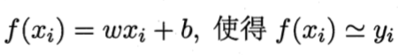

如何确定$w和b$呢？显然，关键在于如何衡量$f(x)与y$之间的差别。第二章中介绍过，均方误差是回归任务中常用的性能度量，因此我们可以试图让均方误差最小化，即， 

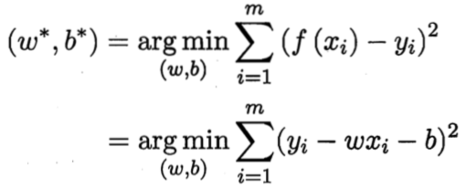

均方误差有非常好的几何意义，它对应了常用的欧几里得距离或简称“欧式距离”（Euclidean distance）。基于均方误差最小化进行模型求解的方法称为“最小二乘法”（least square method）。在线性回归中，最小二乘法就是输入找到一条直线，使所有样本到直线上的欧式距离之和最小。

 求解$w和b$使，

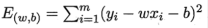

最小化的过程，称为线性回归模型的最小二乘“参数估计”（parameter estimation）。我们可以将E(w,b)分别对w和b求导，得到，  

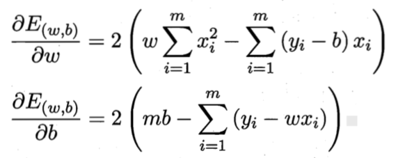

然后，另上面的式子为零，从而求得w和b的最优解， 

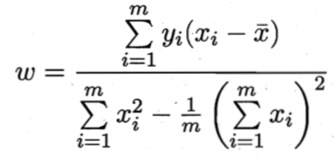

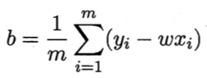

------

更一般的情况是数据集D，样本由d个属性描述。 此时我们试图学得， 

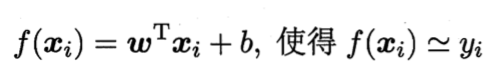

这称为“多元线性回归”（multivariate linear regression）。 类似的，可利用最小二乘法来对w和b进行估计。为了便于讨论，我们把$w和b$吸入向量形式， 

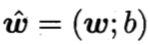

相应的，把数据集D表示为一个mx(d+1)大小的矩阵X，其中，每行对应于一个示例，该行前d个元素对应于示例的d个属性值，最后一个元素恒置为1，即， 

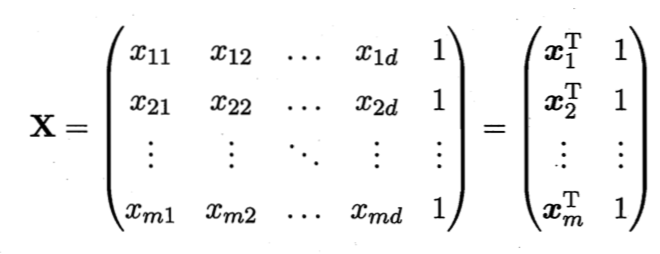

再把标记也写成向量形式$y=(y1;y2;...;ym)$，则有，

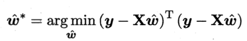

当

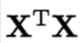

为满秩矩阵或正定矩阵时, 可求得,

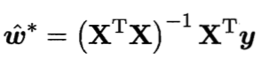

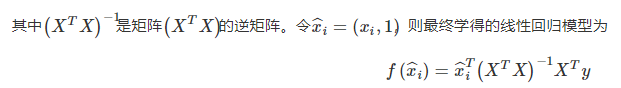

 然而，现实任务中$X^TX$往往不是满秩的。例如我们在实际场景中，经常会遇到这样的数据集，数据的属性超过样例数，导致$X$的列数大于行数，$X^TX$显然不满秩; 也可能由于存在线性相关的属性, 导致$X^TX$不满秩。此时可解出多个$w$的估计值，他们都能使均方误差最小化。这是，通常的做法是引入正则化项，求解出最优解wˆ。也可以这样理解，当数据属性远多于样例数时，更容易出现过拟合，通过引入正则化项，得到稀疏解，降低过拟合的风险。 