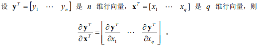
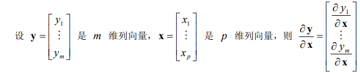
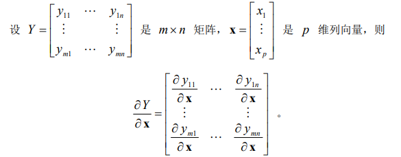

# 机器学习中的线性代数之矩阵求导

{元素,行向量,列向量,矩阵} 做笛卡尔积: {元素,行向量,列向量,矩阵} x {元素,行向量,列向量,矩阵}, 一共16种.

详细参考维基百科Matrix calculus:https://en.wikipedia.org/wiki/Matrix_calculus#Scalar-by-vector_identities

[TOC]

# 对元素的求导

## 元素对元素求导,很简单.

## 向量对元素求导

##### 行向量对元素求导, 得到size和行向量相同的行向量

##### 列向量对元素求导, 得到size和列向量相同的列向量

## 矩阵对元素求导

##### 得到size和矩阵相同的矩阵

# 对向量的求导

## 对行向量的求导

##### 元素对行向量求导, 得到size与行向量相同的行向量

##### 行向量对行向量求导

##### 列向量对行向量求导, 得到的矩阵, 行数和列向量行数相同, 列数和行向量列数相同

##### 矩阵对行向量求导, 先把矩阵看做一个整体

## 对列向量求导

##### 元素对列向量求导, 得到size相同的列向量

##### 行向量对列向量求导, 得到的矩阵, 行数与列向量行数相同, 列数与行向量列数相同

##### 列向量y对列向量x求导,  先把第二个列向量x看成一个整体

##### 矩阵对列向量求导, 先把列向量看成一个整体

# 对矩阵的求导

##### 元素对矩阵求导, 得到size与矩阵相同的矩阵

##### 行向量对矩阵求导, 先把行向量看做一个整体对矩阵求导

##### 列向量对矩阵求导, 先把矩阵看做一个整体

##### 矩阵对矩阵求导

矩阵M1对矩阵M2求导, 可以先把M1分解成列向量V1(V1的每一维是一个行向量), 把M2分解成行向量V2(V2的每一维是一个列向量),  然后再按照向量求导一步一步简化.

#### 

注意: 反之,如果把M1分解成行向量, 把M2分解成列向量, 得到的求导结果不正确

