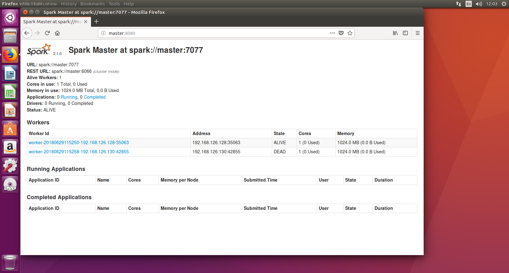

# Spark Installation and Configuration

[TOC]


## jdk安装

### 安装openjdk-7-jre 和 openjdk-7-jdk 找不到源，及解决办法：

1. #### 修改apt-get install 源，这种也failed了：

   ​	/etc/apt/sources.list

   ​	先备份

   ​	删除原内容，修改为阿里源：（删除所有内容：插入模式：ggdG \ 命令模式：%d）

   ```
   deb-src http://archive.ubuntu.com/ubuntu xenial main restricted #Added by software-properties deb http://mirrors.aliyun.com/ubuntu/ xenial main restricted deb-src http://mirrors.aliyun.com/ubuntu/ xenial main restricted multiverse universe #Added by software-properties deb http://mirrors.aliyun.com/ubuntu/ xenial-updates main restricted deb-src http://mirrors.aliyun.com/ubuntu/ xenial-updates main restricted multiverse universe #Added by software-properties deb http://mirrors.aliyun.com/ubuntu/ xenial universe deb http://mirrors.aliyun.com/ubuntu/ xenial-updates universe deb http://mirrors.aliyun.com/ubuntu/ xenial multiverse deb http://mirrors.aliyun.com/ubuntu/ xenial-updates multiverse deb http://mirrors.aliyun.com/ubuntu/ xenial-backports main restricted universe multiverse deb-src http://mirrors.aliyun.com/ubuntu/ xenial-backports main restricted universe multiverse #Added by software-properties deb http://archive.canonical.com/ubuntu xenial partner deb-src http://archive.canonical.com/ubuntu xenial partner deb http://mirrors.aliyun.com/ubuntu/ xenial-security main restricted deb-src http://mirrors.aliyun.com/ubuntu/ xenial-security main restricted multiverse universe #Added by software-properties deb http://mirrors.aliyun.com/ubuntu/ xenial-security universe deb http://mirrors.aliyun.com/ubuntu/ xenial-security multiverse
   ```

    	update命令：sudo apt-get update

   修改源之后，还是找不到openjdk-7-jre 和 openjdk-7-jdk 。

2. #### 添加了ppa，就可以安装openjdk-7-jre 和 openjdk-7-jdk了，但网速特慢：

   ```
   sudo add-apt-repository ppa:openjdk-r/ppa  
   sudo apt-get update   
   ```

    执行 sudo apt-get install openjdk-7-jre openjdk-7-jdk 进行安装。

    但是安装openjdk速度太慢， 好几个小时，于是放弃了。转而安装Oracle的jdk.

### 安装Oracle的jdk(最后使用这种方法配置的JDK):

有两种方法

#### 方法一：apt-get install安装

​	添加ppa

```
sudo add-apt-repository ppa:webupd8team/java
sudo apt-get update
```

​	安装oracle-java-installer

```
sudo apt-get install oracle-java7-installer
```

####  方法二：下载JDK的tar.gz包 [下载地址](http://www.oracle.com/technetwork/java/javase/downloads/jdk7-downloads-1880260.html)  [参考网站](https://blog.csdn.net/rflyee/article/details/8989663)

​	注意下载的jdk包版本可能会变化

​	最后jdk的安装路径在：/usr/lib/jvm/jdk-10.0.1

​	添加JAVA_HOME环境变量到~/.bashrc中，并让其生效：

​		vim ~/.bashrc

​		export JAVA_HOME=/usr/lib/jvm/jdk-10.0.1

​		source ~/.bashrc

​	检验是否设置正确：

​		echo $JAVA_HOME     # 检验变量值

​		java -version

​		$JAVA_HOME/bin/java -version  # 与直接执行 java -version 一样

​	**最后使用方法二配置好了JDK**

#### 低级错误，jdk下载了32位的，系统是64位的：

最后发现JDK10.0.1版本过高，后面安装hadoop和spark的时候都报错。切换到jdk1.8.0_171

切换jdk的过程中，修改了~/.bashrc和/etc/profile中的JAVA_HOME环境变量，输入java -version还是报错

傻傻的，刚才的原因是因为，64位的ubuntu安装了32位jdk

切换版本方法：

把jdk的安装包解压到/usr/lib/jvm/下，并把~/.bashrc和/etc/profile中的$JAVA_HOME改成新的jdk路径。就ok.


## Hadoop 配置

hadoop主要版本：Hadoop 1.x.y 和 Hadoop 2.x.y 系列

### 新增名为hadoop的ubuntu用户并配置ssh

```
sudo useradd -m hadoop -s /bin/bash
```

设置密码

```
sudo passwd hadoop
```

添加root权限

```
sudo adduser hadoop sudo
```

更新apt

```
sudo apt-get update
```

安装vim

```
sudo apt-get install vim
```

安装ssh、配置ssh无密码登陆

```
sudo apt-get install openssh-server
```

 ssh登陆本机：

```
ssh localhost
```

出现提示按yes:

 

但这样登陆是需要每次输入密码的，我们需要配置成SSH无密码登陆比较方便。

首先退出刚才的 ssh，就回到了我们原先的终端窗口，然后利用 ssh-keygen 生成密钥，并将密钥加入到授权中：

```
exit                           # 退出刚才的 ssh localhost
cd ~/.ssh/                     # 若没有该目录，请先执行一次ssh localhost
ssh-keygen -t rsa              # 会有提示，都按回车就可以
cat ./id_rsa.pub >> ./authorized_keys  # 加入授权
```

接着用ssh localhost命令，就无需输入密码就可以直接登陆了。

### 安装Hadoop 2.7.1

下载hadoop2.7.1，并安装到/usr/local中

```
sudo tar -xzf ~/Downloads/hadoop 2.7.1 /usr/local
cd /usr/local
sudo mv ./hadoop2.7.1 ./hadoop
sudo chown -R hadoop ./hadoop
```

解压后，检查Hadoop是否可用：

```
cd /usr/local/hadoop
./bin/hadoop version
```

#### **hadoop单机配置(非分布式)** 检查单机情况下是否可以使用：

运行wordcount例子：

```
cd /usr/local/hadoop
mkdir ./input
cp ./etc/hadoop/*.xml ./input   # 将配置文件作为输入文件
./bin/hadoop jar ./share/hadoop/mapreduce/hadoop-mapreduce-examples-*.jar grep ./input ./output 'dfs[a-z.]+'
cat ./output/*          # 查看运行结果
```

结果如图：

 


#### **Hadoop伪分布式配置**

hadoop的配置文件位于/usr/local/hadoop/etc/hadoop中，伪分布式需要修改2个配置文件core-site.xml和hdfs-site.xml。hadoop的配置文件是xml格式，每个配置以声明property的name和value的方式来实现。

**修改配置文件core-site.xml**，将当中的

```xml
<configuration>
</configuration>
```

修改为下面的配置:

```xml
<configuration>
    <property>
        <name>hadoop.tmp.dir</name>
        <value>file:/usr/local/hadoop/tmp</value>
        <description>Abase for other temporary directories.</description>
    </property>
    <property>
        <name>fs.defaultFS</name>
        <value>hdfs://localhost:9000</value>
    </property>
</configuration>
```

同样的，**修改hdfs-site.xml**：

```xml
<configuration>
    <property>
        <name>dfs.replication</name>
        <value>1</value>
    </property>
    <property>
        <name>dfs.namenode.name.dir</name>
        <value>file:/usr/local/hadoop/tmp/dfs/name</value>
    </property>
    <property>
        <name>dfs.datanode.data.dir</name>
        <value>file:/usr/local/hadoop/tmp/dfs/data</value>
    </property>
</configuration>
```

Hadoop配置文件说明:

Hadoop 的运行方式是由配置文件决定的（运行 Hadoop 时会读取配置文件），因此如果需要从伪分布式模式切换回非分布式模式，需要删除 core-site.xml 中的配置项。

此外，伪分布式虽然只需要配置 fs.defaultFS 和 dfs.replication 就可以运行（官方教程如此），不过若没有配置 hadoop.tmp.dir 参数，则默认使用的临时目录为 /tmp/hadoo-hadoop，而这个目录在重启时有可能被系统清理掉，导致必须重新执行 format 才行。所以我们进行了设置，同时也指定 dfs.namenode.name.dir 和 dfs.datanode.data.dir，否则在接下来的步骤中可能会出错。

配置完成后，**执行NameNode的格式化**。切换到/usr/local/hadoop下，执行：

```shell
./bin/hdfs namenode -format
```

成功的话，会出现“successfully formated”和"Exitting with status 0"

 

#### **接着开启 NameNode 和 DataNode 守护进程：**(启动hadoop)

```bash
./sbin/start-dfs.sh  #start-dfs.sh是个完整的可执行文件，中间没有空格
```

通过jps判断是否成功启动：

 


#### **运行Hadoop伪分布式实例：**

上面的单机模式，grep 例子读取的是本地数据，伪分布式读取的则是 HDFS 上的数据。要使用 HDFS，首先需要在 HDFS 中创建用户目录： 

```
 ./bin/hdfs dfs -mkdir -p /user/hadoop
```

这个命令不太懂，使用了一下./bin/hdfs dfs -ls 想试着列出hdfs上的文件目录，没有成功，并输出一些警告.

原来是这样用的：(-ls 后面要加文件路径)

```
./bin/hdfs dfs -ls input
```

**./bin/hdfs在目录：/usr/local/hadoop/下**


注意：每次运行hadoop程序时，如果已经存在输出文件，则要先删除再执行，否则会报错。


## 安装Spark

下载Spark， 访问[Spark官方下载地址](http://spark.apache.org/downloads.html)，按照如下图下载 

 

下载后：

```shell
sudo tar -zxf ~/下载/spark-2.1.0-bin-without-hadoop.tgz -C /usr/local/
cd /usr/local
sudo mv ./spark-2.1.0-bin-without-hadoop/ ./spark
sudo chown -R hadoop:hadoop ./spark          # 此处的 hadoop 为你的用户名
```

还需要修改Spark的配置文件spark-env.sh

```shell
cd /usr/local/spark
cp ./conf/spark-env.sh.template ./conf/spark-env.sh
```

编辑spark-env.sh ，在第一行添加以下配置信息：

```shell
export SPARK_DIST_CLASSPATH=$(/usr/local/hadoop/bin/hadoop classpath)
```

运行Spark自带的例子，看是否安装成功：

```shell
cd /usr/local/spark
bin/run-example SparkPi
```

输出信息太多，用grep进行过滤：

```shell
bin/run-example SparkPi 2>&1 | grep "Pi is"
```

这里涉及到Linux Shell中管道的知识，详情可以参考[Linux Shell中的管道命令](http://dblab.xmu.edu.cn/blog/824-2/) 

输出结果：

 

可以看出程序成功运行，spark已经安装成功了。


### 在spark shell 中运行代码

学习Spark程序开发，建议首先通过**spark-shell**交互式学习，加深Spark程序开发的理解。 

如果在使用Spark的过程中需要用到HDFS， 就要首先启动Hadoop，如果spark不使用HDFS和yarn，那么就不用启动Hadoop也可以正常使用Spark.

假设先不需要用到HDFS，因此就没有启动Hadoop。现在我们直接开始使用Spark。

#### **spark-shell命令及其常用的参数**：

```shell
./bin/spark-shell --master <master-url>
```

**spark的运行模式**，取决于传递给SparkContext的Master URL的值。Master URL可以是以下任一种形式：

- local 使用一个Worker线程本地化运行SPARK(完全不并行) 
- local[*] 使用逻辑CPU个数数量的线程来本地化运行Spark
- local[K] 使用K个Worker线程本地化运行Spark（理想情况下，K应该根据运行机器的CPU核数设定） 
- spark://HOST:PORT 连接到指定的Spark standalone master。默认端口是7077. 
- yarn-client 以客户端模式连接YARN集群。集群的位置可以在HADOOP_CONF_DIR 环境变量中找到。 
- yarn-cluster 以集群模式连接YARN集群。集群的位置可以在HADOOP_CONF_DIR 环境变量中找到。 
- mesos://HOST:PORT 连接到指定的Mesos集群。默认接口是5050。 

#### **使用本地模式(local)运行Spark**

```shell
./bin/spark-shell --master local
```

关于如何在集群模式下运行Spark,可以参考后面的“[在集群上运行Spark应用程序](http://dblab.xmu.edu.cn/blog/1217-2/)”。 

比如，要采用本地模式，在4个CPU核心上运行spark-shell:

出现了错误：Failed to initialize compiler: object java.lang.Object in compiler mirror not found.

可能是jkd版本过高的原因，jdk10+了

果然是这个原因，切换到jdk8后，就解决了。


#### **打开spark-shell进行scala交互式编程**：

在spark安装路径/usr/local/spark/下输入

```
./bin/spark-shell
```

 

退出：

```
:quit
```


#### **测试Spark是否可以正常访问Ubuntu系统中的本地文件**

在~/Documents/中新建文件word.txt，并在其中输入2行文字，保存

进入spark-shell，输入：

```
scala> val line=sc.textFile("file:///home/hadoop/word.txt")

scala> println(line.count())
```

输出：

2

程序能正常运行，说明spark可以访问ubuntu系统中的本地文件


#### **测试Spark是否能够正常访问Hadoop中的HDFS**

1. 启动hadoop：

```shell
cd /usr/local/hadoop

./sbin/start-dfs.sh

jps   # 查看是否成功启动
```

2. 创建hongbo的对应主目录:(虚拟机ubuntu的内网IP：192.168.126.128)

```shell
cd /usr/local/hadoop
./bin/hdfs dfs -mkdir -p /user/hongbo    ##也就是"hdfs://192.168.126.128:9000/user/hongo"
```

3. 把已经建好的Ubuntu系统中的本地文件/home/hongbo/Documents/word.txt上传到HDFS中，命令如下：

```shell
cd /usr/local/hadoop
./bin/hdfs dfs -put /home/hongbo/Documents/word.txt /user/hongbo
```

4. 上传成功以后，可以使用如下命令查看一下HDFS中的word.txt的内容：

```shell
cd /user/local/hadoop
./bin/hdfs dfs -cat /user/hongbo/word.txt
```

这时候，会在屏幕上显示出word.txt中的各行单词。

然后，在ubuntu的终端中启动进入spark-shell交互式执行环境，测试Spark读取HDFS数据是否成功。

##### **首先用虚拟机ubuntu的内网IP地址去测试**：

```shell
val line=sc.textFile("hdfs://192.168.126.128:9000/user/hadoop/word.txt")
println(line.count())
```


可以看出上述方式不行。我们选另外一种方式。

##### **使用127.0.01来测试：**


可以看出，这种方式同样不行。

##### **使用localhost 来测试：**

同样也不行。

##### **只有如下方式可以成功：**


但是这种方式在IntelliJ IDEA中，又会出错，后面有篇博客会专门介绍[如何使用IntelliJ IDEA工具调试Spark应用程序](http://dblab.xmu.edu.cn/blog/2024-2/)，在那篇博客中，会解决这个问题。 

实际上，如果通过修改/etc/hosts这个文件，我们也可以让下面这种采用阿里云ECS实例的私网IP地址的测试也能够成功。 

```bash
scala> val line=sc.textFile("hdfs://192.168.1.106:9000/user/linziyu/word.txt")
```

具体方法如下：

```
sudo vim /etc/hosts
```

注释掉# The following lines are desirable for IPv6 capable hosts下的所有行。

修改后保存文档并退出vim编辑器。

好像还是不行。不知道是不是因为我在同一台虚拟机上操作的原因。

**修改环境变量：**

```shell
vim ~/.bashrc
```

在~/.bashrc中添加如下内容

```shell
export JAVA_HOME=/usr/lib/jvm/default-java
export HADOOP_HOME=/usr/local/hadoop
export SPARK_HOME=/usr/local/spark
export PYTHONPATH=$SPARK_HOME/python:$SPARK_HOME/python/lib/py4j-0.10.4-src.zip:$PYTHONPATH
export PYSPARK_PYTHON=python3
export PATH=$HADOOP_HOME/bin:$SPARK_HOME/bin:$PATH
```

source ~/.bashrc


### **在pyspark中运行代码：**

如果设置了PYSPARK_PYTHON环境变量，则使用如下命令启动pyspark

```
bin/pyspark
```

如果没有设置，则可以如下启动：

```shell
PYSPARK_PYTHON=python3 ./bin/pyspark
```

pyspark命令及其常用的参数如下：

```shell
./bin/pyspark --master <master-url>
```

参数设置和scala类似：

Spark的运行模式取决于传递给SparkContext的Master URL的值。Master URL可以是以下任一种形式：
\* local 使用一个Worker线程本地化运行SPARK(完全不并行)
\* local[*] 使用逻辑CPU个数数量的线程来本地化运行Spark
\* local[K] 使用K个Worker线程本地化运行Spark（理想情况下，K应该根据运行机器的CPU核数设定）
\* spark://HOST:PORT 连接到指定的Spark standalone master。默认端口是7077.
\* yarn-client 以客户端模式连接YARN集群。集群的位置可以在HADOOP_CONF_DIR 环境变量中找到。
\* yarn-cluster 以集群模式连接YARN集群。集群的位置可以在HADOOP_CONF_DIR 环境变量中找到。
\* mesos://HOST:PORT 连接到指定的Mesos集群。默认接口是5050。

需要强调的是，这里我们采用“本地模式”（local）运行Spark，关于如何在集群模式下运行Spark，可以参考后面的“[在集群上运行Spark应用程序](http://dblab.xmu.edu.cn/blog/1217-2/)”。
在Spark中采用本地模式启动pyspark的命令主要包含以下参数：
–master：这个参数表示当前的pyspark要连接到哪个master，如果是local[*]，就是使用本地模式启动pyspark，其中，中括号内的星号表示需要使用几个CPU核心(core)；
–jars： 这个参数用于把相关的JAR包添加到CLASSPATH中；如果有多个jar包，可以使用逗号分隔符连接它们；

启动pyspark后，会出现如下界面：

 


## 启动Spark集群时遇到问题：

先启动hadoop，再启动spark,

不知道哪里配置有问题，修改了/etc/hosts



最后终于还是启动起来了，但是可能还有点小问题。

参考了知乎的一片文章：

https://zhuanlan.zhihu.com/p/33116895 来设置/etc/hosts

林子雨教程http://dblab.xmu.edu.cn/blog/1714-2/ 没有提到设置/etc/hosts


后序，再去实验室找2台机子配置一下。如果能再找2台。这样就有了一个服务器集群。内存可以设置到74+13+13=100G。

