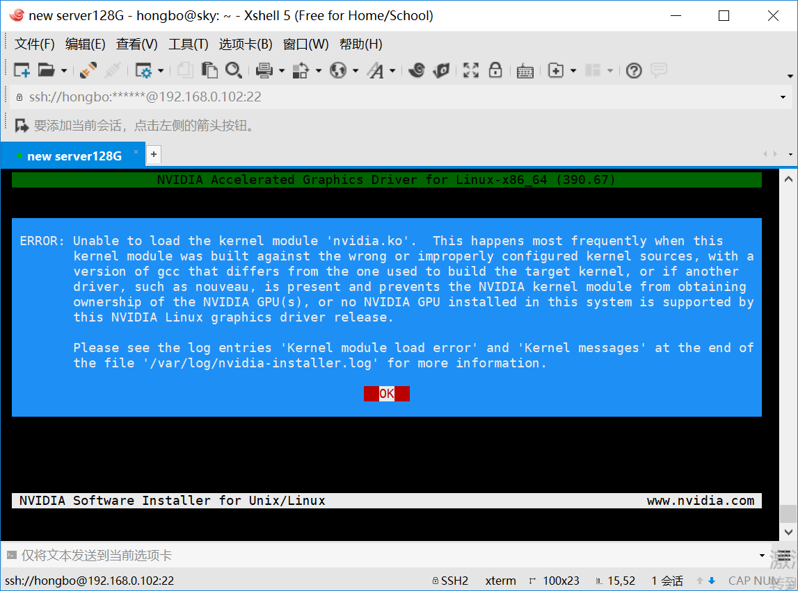
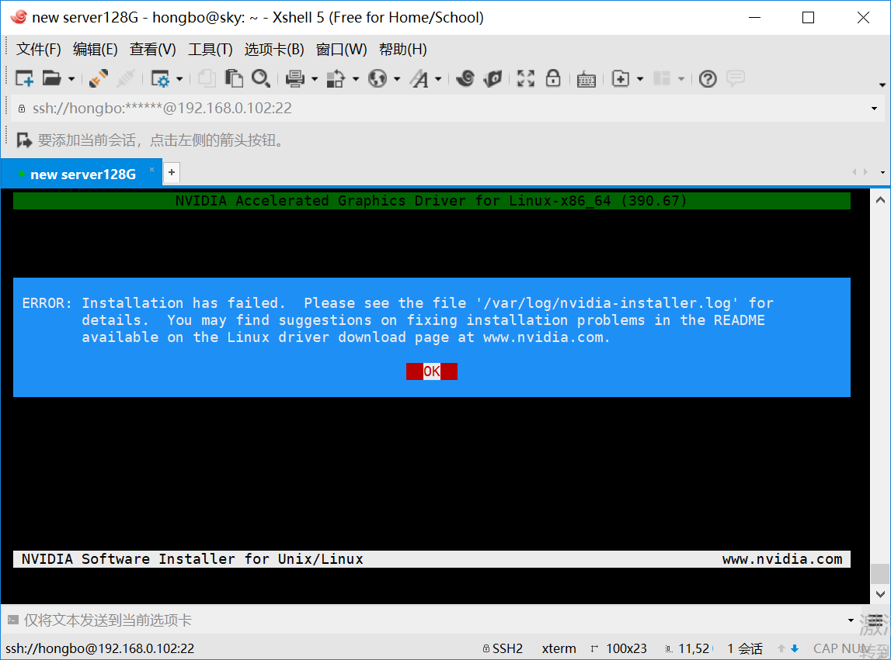
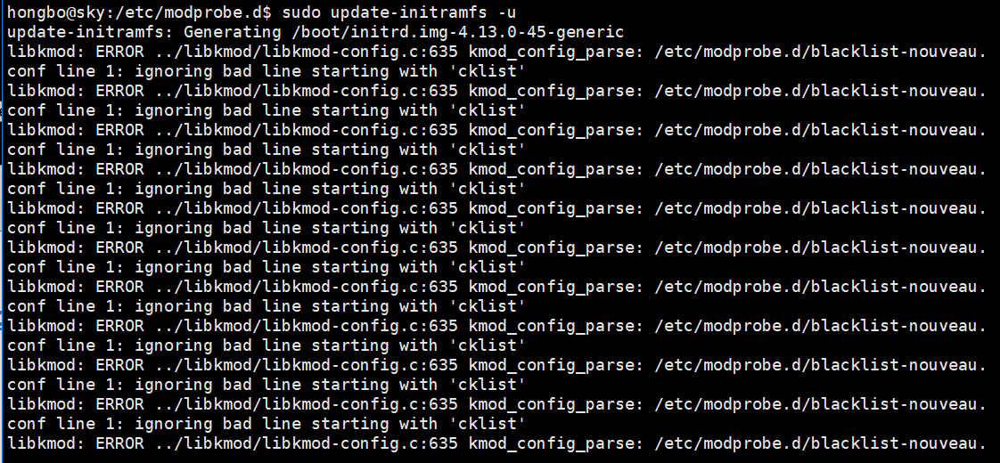
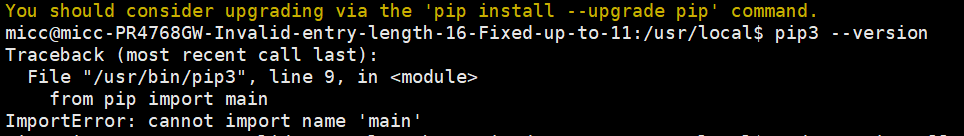

# 安装深度学习套件


更新source.list

```
cd /etc/apt/
sudo cp sources.list sources.list.bak
sudo vi sources.list

# 更新：
sudo apt-get update
sudo  apt-get upgrade
```

将pip源指向阿里云的源镜像：<http://mirrors.aliyun.com/help/pypi>，具体添加一个 ~/.config/pip/pip.conf 文件，设置为：

新建文件的时候，发现不存在~/.config/pip/文件夹，自己创建了一个。

```
[global]
trusted-host =  mirrors.aliyun.com
index-url = http://mirrors.aliyun.com/pypi/simple
```

## 安装1080TI显卡驱动: 

```
sudo apt-get purge nvidia*
sudo add-apt-repository ppa:graphics-drivers/ppa
sudo apt-get update && sudo apt-get install nvidia-384 nvidia-settings
```

### 安装后重启，重复提示登录ubuntu

### 参考：https://www.jianshu.com/p/34236a9c4a2f  卸载驱动：

```
sudo apt-get remove --purge nvidia-*
sudo apt-get install ubuntu-desktop
sudo rm /etc/X11/xorg.conf
echo 'nouveau' | sudo tee -a /etc/modules
sudo reboot
```

### 按照https://blog.csdn.net/qq_33028071/article/details/76408131 安装，出错：






### 按照https://blog.csdn.net/qq_15933615/article/details/79600525重装：

sudo update-initramfs -u 

到上面这一步时，出错：



后面发现是blacklist-nouveau.conf配置出错，cklist...无语了。

### 下载老版本的1080TI驱动，重新安装

按照：https://blog.csdn.net/qq_15933615/article/details/79600525重装。

版本是378.34： https://www.geforce.cn/drivers/results/127174

还是不行。


### 重新安装

按照这个：https://blog.csdn.net/lwplwf/article/details/79881699

提示已经安装了最新版的GPU驱动；

重启后，又进入登录界面无限循环。


修改好blacklist-nouveau.conf配置文件后，再重新安装：

按照：https://blog.csdn.net/qq_15933615/article/details/79600525


## Ubuntu 16.04 用户登录界面死循环问题的解决

（1）ssh登录

（2）Uninstall any previous drivers:

sudo apt-get remove nvidia-*

sudo apt-get autoremove

（3）Uninstall the drivers from the .run file:

sudo nvidia-uninstall   //此步报错，nvidia-uninstall不存在

（4）此时，重启可login normally. 
（5）驱动重新安装：

(1)Ctrl+Alt+F1 
(2)sudo service lightdm stop 
(3)sudo bash ./NVIDIA-Linux-x86_64-xxx.xxx.run -no-x-check -no-nouveau-check -no-opengl-files

-no-x-check安装驱动时关闭x服务; 
-no-nouveau-check 安装驱动时禁用Nouveau 
-no-opengl-files 安装时只装驱动文件，不安装Opengl

（6）sudo service lightdm restart（可正常登录）   //还是不能正常登录

出现警告对话框：

The system is running in low-graphics mode

（7）重启不会出现循环登录。   //重启还是出现这个问题。


### 重新安装GPU驱动：

参考：https://blog.csdn.net/u011494081/article/details/78076674


### 安装CUDA8.0

参考：[深度学习配置：Ubuntu 16.04.2 + GTX 1070 +CUDA 8.0 +cuDNN 5.1 + TensorFlow 安装](https://zhuanlan.zhihu.com/p/27168325)

下载地址：https://developer.nvidia.com/cuda-80-ga2-download-archive


安装CUDNN

下载地址：

https://www.zhihu.com/question/37082272

链接：[http://pan.baidu.com/s/1nv5HKFZ](https://link.zhihu.com/?target=http%3A//pan.baidu.com/s/1nv5HKFZ) 密码：kzcf 

安装参考：https://zhuanlan.zhihu.com/p/27168325


pip3 install --upgrade pip  导致出错：



卸载pip3：https://blog.csdn.net/tiweeny/article/details/78384633


pip3: 出错了

pip：其实是pip3

pip2: pip2


安装anaconda3:

下载地址：https://www.jianshu.com/p/1c9a66207538


sudo vim /etc/network/interfaces

```
auto lo
iface lo inet loopback
auto eth0
iface eth0 inet dhcp
```

参考: https://blog.csdn.net/u012432611/article/details/53967384


安装pip3:

sudo apt-get install pip3

升级pip3:

修改源：  ~/.pip/pip.conf  参考：https://www.cnblogs.com/lpl521/p/6778048.html

sudo -H pip3 install --upgrade pip


错误：

```
The directory '/home/apollo/.cache/pip/http' or its parent directory is not owned by the current user and the cache has been disabled. Please check the permissions and owner of that directory. If executing pip with sudo, you may want sudo's -H flag.
The directory '/home/apollo/.cache/pip' or its parent directory is not owned by the current user and caching wheels has been disabled. check the permissions and owner of that directory. If executing pip with sudo, you may want sudo's -H flag.
```

修复参考：https://stackoverflow.com/questions/27870003/pip-install-please-check-the-permissions-and-owner-of-that-directory

```
$ sudo chown -R USERNAME /home/apollo/.cache/pip/http
$ sudo chown -R USERNAME /home/apollo/.cache/pip
```

USERNAME 修改为你的用户名