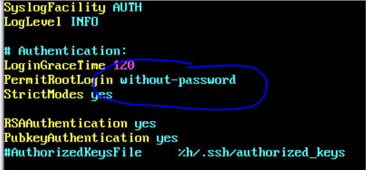

https://blog.csdn.net/mango_song/article/details/8314406

sudo ufw disable

重启

https://blog.csdn.net/m0_37975886/article/details/78405808

lsof -i:22

没有输出，22端口没有开放？

openssh-server已经装好了，在运行

https://blog.csdn.net/Sky_rabbit94/article/details/52903855

登陆root， 查看Vi /etc/ssh/sshd_config  

之前是prohibit-passwd，后面改成yes，然后重启ssh:

sudo /etc/init.d/ssh restart  

添加新user(hongbo)之后，可以ssh登陆了。

 

但是重新登陆root，把yes改为prohibit-password后，再ssh登陆hongbo，还是能成功。

搞定！

